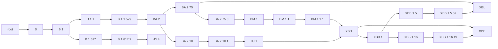
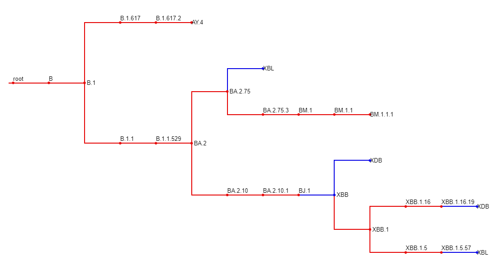
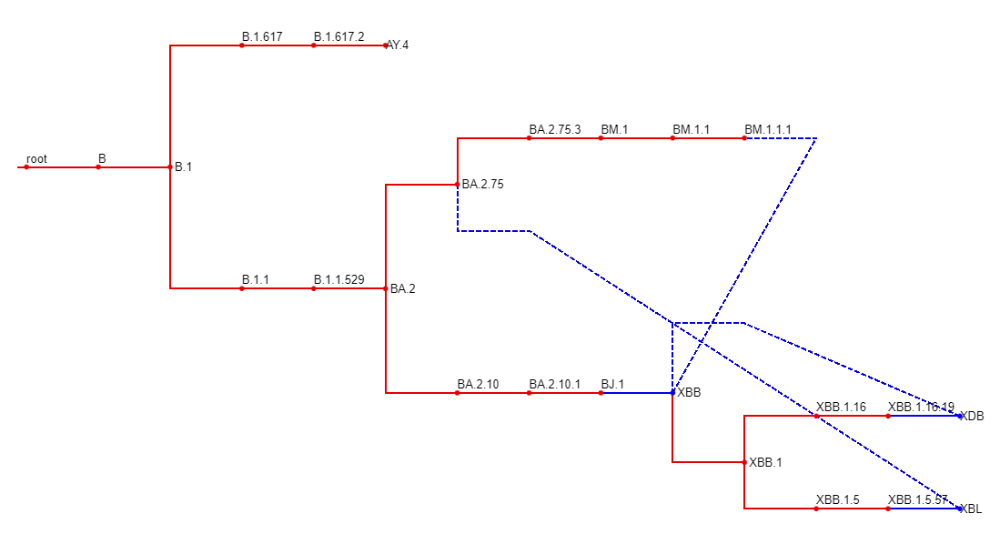

# pangonet

Create and manipulate SARS-CoV-2 pango lineages in a phylogenetic network.

`pangonet` is written in standard python and has no dependencies aside from `python>=3.7`.

## Install

1. `pangonet` can be installed from source as a CLI tool and python package.

    ```bash
    git clone https://github.com/ktmeaton/pangonet.git
    cd pangonet
    pip install .
    pangonet --help
    ```

1. `pangonet` can also be downloaded and run as a script.

    ```bash
    wget https://raw.githubusercontent.com/ktmeaton/pangonet/main/src/pangonet/pangonet.py
    python pangonet.py --help
    ```

## Usage

### Command-Line Interface

The command-line interface `pangonet` can be used to download the latest designated lineages and export a network for downstream applications.

1. Display help and usage.

    ```bash
    $ pangonet --help

    Create and manipulate SARS-CoV-2 pango lineages in a phylogenetic network.

    options:
    -h, --help            show this help message and exit
    --lineage-notes LINEAGE_NOTES
                            Path to the lineage_notes.txt
    --alias-key ALIAS_KEY
                            Path to the alias_key.json
    --output-prefix OUTPUT_PREFIX
                            Output prefix
    --output-all          Output all formats
    --tsv                 Output metadata TSV
    --json                Output json
    --nwk                 Output newick tree
    --enwk                Output extended newick tree for IcyTree
    --mermaid             Output mermaid graph
    --dot                 Output dot for graphviz
    -v, --version         Print version
    ```

1. Create a network from the latest designated lineages.

    ```bash
    $ pangonet --output-prefix output/pangonet --output-all

    2024-07-18 14:05:20,587 INFO:Begin
    2024-07-18 14:05:20,591 INFO:Downloading alias key: output/alias_key.json
    2024-07-18 14:05:20,845 INFO:Downloading lineage notes: output/lineage_notes.txt
    2024-07-18 14:05:21,298 INFO:Creating aliases.
    2024-07-18 14:05:21,301 INFO:Creating network.
    2024-07-18 14:05:21,517 INFO:Exporting table: output/pangonet.tsv
    2024-07-18 14:05:21,569 INFO:Exporting standard newick: output/pangonet.nwk
    2024-07-18 14:05:21,580 INFO:Exporting extended newick: output/pangonet.enwk
    2024-07-18 14:05:21,589 INFO:Exporting mermaid: output/pangonet.mermaid
    2024-07-18 14:05:21,597 INFO:Exporting dot: output/pangonet.dot
    2024-07-18 14:05:21,602 INFO:Exporting json: output/pangonet.json
    2024-07-18 14:05:21,662 INFO:Exporting condensed json: output/pangonet.condensed.json
    2024-07-18 14:05:21,757 INFO:Done
    ```

Please see the [Visualize](#visualize) section for more information on the various output formats.

### Package

The `pangonet` python package provides functions to construct and manipulate a network of pango lineages.

```python
from pangonet import PangoNet

# Build the network by downloading the latest designations
pango = PangoNet().build()

# Or, build the network from local files
pango = PangoNet().build(alias_key="alias_key.json", lineage_notes="lineage_notes.txt")
```

Compress and decompress aliases.

> ❗ See [pango_aliasor](https://github.com/corneliusroemer/pango_aliasor) for a more sophisticated approach to alias compression.

```python
pango.decompress("KP.3.1")
'B.1.1.529.2.86.1.1.11.1.3.1'

pango.compress('B.1.1.529.2.86.1.1.11')
'JN.1.11'
```

Get immediate children and parents.

```python
# Using a compressed lineage name
pango.get_children("JN.1.1")
['JN.1.1.1', 'JN.1.1.2', 'JN.1.1.3', 'JN.1.1.4', 'JN.1.1.5', 'JN.1.1.6', 'JN.1.1.7', 'JN.1.1.8', 'JN.1.1.9', 'JN.1.1.10', 'XDN', 'XDR']

# Using the full lineage name
pango.get_parents('B.1.1.529.2.86.1.1.1')
['BA.2.86.1']

# Recombinants (X*) will have multiple
pango.get_parents('XBL')
['XBB.1.5.57', 'BA.2.75']
```

Get comprehensive descendants and ancestors, following all possible paths.

```python
# Follow all possible paths to terminals
pango.get_descendants("JN.1.1")
['JN.1.1.1', 'XDK', 'XDK.1', 'XDK.1.1', 'XDK.1.2', 'XDK.2', 'XDK.3', 'XDK.4', 'XDK.4.1', 'XDK.5', 'XDK.6', 'JN.1.1.2', 'JN.1.1.3', 'LT.1', 'JN.1.1.4', 'JN.1.1.5', 'KR.1', 'KR.1.1', 'KR.1.2', 'KR.3', 'KR.4', 'KR.5', 'JN.1.1.6', 'KZ.1', 'KZ.1.1', 'KZ.1.1.1', 'JN.1.1.7', 'LC.1', 'JN.1.1.8', 'JN.1.1.9', 'JN.1.1.10', 'XDZ', 'XDN', 'XDR', 'XDR.1']

# Follow all possible paths to the root
pango.get_ancestors("XDB")
['XBB.1.16.19', 'XBB.1.16', 'XBB.1', 'XBB', 'BJ.1', 'BA.2.10.1', 'BA.2.10', 'BA.2', 'B.1.1.529', 'B.1.1', 'B.1', 'B', 'root', 'BM.1.1.1', 'BM.1.1', 'BM.1', 'BA.2.75.3', 'BA.2.75']
```

Filter the network to lineages of interest.

```python
# Create a network of the following lineages and their ancestors.
lineages = []
for l in ["XDB", "XBL", "AY.4"]:
    lineages += l
    lineages += pango.network[l]["ancestors"]
pango_filter = pango.filter(lineages)

print(list(pango_filter.network))
['root', 'B', 'B.1', 'B.1.1', 'B.1.1.529', 'BA.2', 'BA.2.10', 'BA.2.10.1', 'BJ.1', 'BA.2.75', 'BA.2.75.3', 'BM.1', 'BM.1.1', 'BM.1.1.1', 'B.1.617', 'B.1.617.2', 'AY.4', 'XBB', 'XBB.1', 'XBB.1.5', 'XBB.1.5.57', 'XBB.1.16', 'XBB.1.16.19', 'XBL', 'XDB']
```

### Visualize

`pangonet` also allows you to export the network in a wide variety of formats. We will filter down the lineages to better demonstrate visualization.

```python
from pangonet import PangoNet

pango = PangoNet().build()
lineages = []
for l in ["XDB", "XBL", "AY.4"]:
    lineages += l
    lineages += pango.network[l]["ancestors"]
pango_filter = pango.filter(lineages)

```

#### Mermaid

Mermaid files can be visualized with the online tool: https://mermaid.live/

```python
print(pango_filter.to_mermaid())
```



#### Newick

`pangonet` can export trees in standard and [extended](https://en.wikipedia.org/wiki/Newick_format#Extended_Newick) newick. In extended newick, recominbant lineages will have edges connecting to all parents. In standard newick, recombinant lineages will only have one edge connecting it to the first parent.

Extended newick can be visualized with IcyTree online: https://icytree.org/

| Standard Newick | Extended Newick |
| ------ | --------------- |
|        | 

#### Standard Newick

```python
print(pango_filter.to_newick(extended=False))
```

```text
(((((((((((((XBL:1)XBB.1.5.57:1)XBB.1.5:1,((XDB:1)XBB.1.16.19:1)XBB.1.16:1)XBB.1:1,XDB:1)XBB:1)BJ.1:1)BA.2.10.1:1)BA.2.10:1,((((BM.1.1.1:1)BM.1.1:1)BM.1:1)BA.2.75.3:1,XBL:1)BA.2.75:1)BA.2:1)B.1.1.529:1)B.1.1:1,((AY.4:1)B.1.617.2:1)B.1.617:1)B.1:1)B:1)root:0;
```

#### Extended Newick

```python
print(pango_filter.to_newick(extended=True))
```

```text
(((((((((((((XBL#XBL:1)XBB.1.5.57:1)XBB.1.5:1,((XDB#XDB:1)XBB.1.16.19:1)XBB.1.16:1)XBB.1:1,XDB#XDB:1)XBB#XBB:1)BJ.1:1)BA.2.10.1:1)BA.2.10:1,(((((XBB#XBB:1)BM.1.1.1:1)BM.1.1:1)BM.1:1)BA.2.75.3:1,XBL#XBL:1)BA.2.75:1)BA.2:1)B.1.1.529:1)B.1.1:1,((AY.4:1)B.1.617.2:1)B.1.617:1)B.1:1)B:1)root:0;
```

#### JSON

Export the network to a JSON file. This can be standard JSON or a custom compact version where list elements are kept on one line.

```python
print(pango_filter.to_json(compact=True))
```

```json
{
    "root": {
        "decompressed": "",
        "depth": 0,
        "parents": "",
        "children": "B",
        "ancestors": "",
        "descendants": "B, B.1, B.1.1, B.1.1.529, BA.2, BA.2.10, BA.2.10.1, BJ.1, XBB, XBB.1, XBB.1.5, XBB.1.5.57, XBL, XBB.1.16, XBB.1.16.19, XDB, BA.2.75, BA.2.75.3, BM.1, BM.1.1, BM.1.1.1, B.1.617, B.1.617.2, AY.4"
    },
    ...
    "BA.2.10.1": {
        "decompressed": "B.1.1.529.2.10.1",
        "depth": 7,
        "parents": "BA.2.10",
        "children": "BJ.1",
        "ancestors": "BA.2.10, BA.2, B.1.1.529, B.1.1, B.1, B, root",
        "descendants": "BJ.1, XBB, XBB.1, XBB.1.5, XBB.1.5.57, XBL, XBB.1.16, XBB.1.16.19, XDB"
    },
    ...
    "XDB": {
        "decompressed": "XDB",
        "depth": 15,
        "parents": "XBB.1.16.19, XBB",
        "children": "",
        "ancestors": "XBB.1.16.19, XBB.1.16, XBB.1, XBB, BJ.1, BA.2.10.1, BA.2.10, BA.2, B.1.1.529, B.1.1, B.1, B, root, BM.1.1.1, BM.1.1, BM.1, BA.2.75.3, BA.2.75",
        "descendants": ""
    }
}
```
