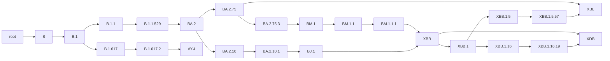

# pangonet

Create and manipulate SARS-CoV-2 pango lineages in a phylogenetic network.



## Why pangonet?

1. **Quickly look up phylogenetic relationships between lineages.**


    Multiple parents due to recombination are handled, as is recursive recombination where a lineage has experienced recombination multiple times in its evolutionary history.

1. **Lots of output formats.**

    The pango network can be exported to: `json`, `tsv`, `mermaid`, `dot` (graphviz), `newick` and [`extended newick`](https://en.wikipedia.org/wiki/Newick_format#Extended_Newick) for recombination. 

1. **Command-line interface and python library that require no input files.**

    All the required resources will be downloaded for you from [pango-designation](https://github.com/cov-lineages/pango-designation)!

1. **`pangonet` is a single script with no dependencies aside from `python`.**

   Sometimes you just need a really simple utility script for a quick lineage query, without having to bother with creating a `conda` environment. You can stick the single `pangonet.py` script in any python project and be good to go. Full package installation is still provided for those who need it.

## Usage

### Python Library

```python
from pangonet.pangonet import PangoNet
pango = PangoNet().build()

# Alias manipulation
pango.uncompress("KP.3.1")
'B.1.1.529.2.86.1.1.11.1.3.1'

pango.compress('B.1.1.529.2.86.1.1.11')
'JN.1.11'

# Get immediate parents and children
pango.get_parents("JN.1")
['BA.2.86.1']

pango.get_children("JN.1")
['JN.1.1.1', 'JN.1.1.2', 'JN.1.1.3', 'JN.1.1.4', 'JN.1.1.5', 'JN.1.1.6', 'JN.1.1.7', 'JN.1.1.8', 'JN.1.1.9', 'JN.1.1.10', 'XDN', 'XDR']

# Get specific paths between lineages, recombination means there might be multiple routes!
pango.get_paths(start="XE", end="B.1.1")
[['XE', 'BA.1', 'B.1.1.529', 'B.1.1'], ['XE', 'BA.2', 'B.1.1.529', 'B.1.1']]

# Or get all ancestors and descendants as big pile
pango.get_ancestors("XE")
['BA.1', 'B.1.1.529', 'B.1.1', 'B.1', 'B', 'root', 'BA.2']

pango.get_descendants("KP.1")
['KP.1.1', 'KP.1.1.1', 'MG.1', 'KP.1.1.2', 'KP.1.1.3', 'LP.1', 'LP.1.1', 'LP.2', 'LP.3', 'KP.1.1.4', 'KP.1.1.5', 'KP.1.2']

# Most recent common ancestor(s) MRCA, recombination means there might be multiple!
pango.get_mrca(["BQ.1", "BA.2.4"])
['B.1.1.529']

pango.get_mrca(["XE", "XG"])
["BA.1", "BA.2"]
```

### Command-Line Interface

```bash
$ pangonet --output-prefix output/pango --output-all

2024-07-18 14:05:20,587 INFO:Begin
2024-07-18 14:05:20,591 INFO:Downloading alias key: output/alias_key.json
2024-07-18 14:05:20,845 INFO:Downloading lineage notes: output/lineage_notes.txt
2024-07-18 14:05:21,298 INFO:Creating aliases.
2024-07-18 14:05:21,301 INFO:Creating network.
2024-07-18 14:05:21,517 INFO:Exporting table: output/pango.tsv
2024-07-18 14:05:21,569 INFO:Exporting standard newick: output/pango.nwk
2024-07-18 14:05:21,580 INFO:Exporting extended newick: output/pango.enwk
2024-07-18 14:05:21,589 INFO:Exporting mermaid: output/pango.mermaid
2024-07-18 14:05:21,597 INFO:Exporting dot: output/pango.dot
2024-07-18 14:05:21,602 INFO:Exporting json: output/pango.json
2024-07-18 14:05:21,662 INFO:Exporting condensed json: output/pango.condensed.json
2024-07-18 14:05:21,757 INFO:Done
```

## Install

- `pangonet` is written in standard python and has no dependencies aside from `python>=3.7`.
- PyPi and conda packages will be coming soon!

1. `pangonet` can be installed from source as a CLI tool and python package.

    ```bash
    git clone https://github.com/phac-nml/pangonet.git
    cd pangonet
    pip install .
    pangonet --help
    ```

1. `pangonet` can also be downloaded and run as a standlone script.

    ```bash
    wget https://raw.githubusercontent.com/phac-nml/pangonet/main/src/pangonet/pangonet.py
    python pangonet.py --help
    ```

## Visualize

`pangonet` also allows you to export the network in a wide variety of formats. We will filter down the lineages to better demonstrate visualization.

```python
from pangonet import PangoNet
pango = PangoNet().build()

lineages = []
for l in ["XDB", "XBL", "AY.4"]:
    lineages += [l] + pango.get_ancestors(l)

pango_filter = pango.filter(lineages)

```

#### Mermaid

Mermaid files can be visualized with the online tool: https://mermaid.live/

```python
print(pango_filter.to_mermaid())
```


#### Newick

`pangonet` can export trees in standard and [extended](https://en.wikipedia.org/wiki/Newick_format#Extended_Newick) newick. In extended newick, recominbant lineages will have edges connecting to all parents. In standard newick, recombinant lineages will only have one edge connecting it to the first parent.

Extended newick can be visualized with IcyTree online: https://icytree.org/

| Standard Newick | Extended Newick |
| ------ | --------------- |
|        | 

#### Standard Newick

```python
print(pango_filter.to_newick(extended=False))
```

```text
(((((((((((((XBL:1)XBB.1.5.57:1)XBB.1.5:1,((XDB:1)XBB.1.16.19:1)XBB.1.16:1)XBB.1:1,XDB:1)XBB:1)BJ.1:1)BA.2.10.1:1)BA.2.10:1,((((BM.1.1.1:1)BM.1.1:1)BM.1:1)BA.2.75.3:1,XBL:1)BA.2.75:1)BA.2:1)B.1.1.529:1)B.1.1:1,((AY.4:1)B.1.617.2:1)B.1.617:1)B.1:1)B:1)root:0;
```

#### Extended Newick

```python
print(pango_filter.to_newick(extended=True))
```

```text
(((((((((((((XBL#XBL:1)XBB.1.5.57:1)XBB.1.5:1,((XDB#XDB:1)XBB.1.16.19:1)XBB.1.16:1)XBB.1:1,XDB#XDB:1)XBB#XBB:1)BJ.1:1)BA.2.10.1:1)BA.2.10:1,(((((XBB#XBB:1)BM.1.1.1:1)BM.1.1:1)BM.1:1)BA.2.75.3:1,XBL#XBL:1)BA.2.75:1)BA.2:1)B.1.1.529:1)B.1.1:1,((AY.4:1)B.1.617.2:1)B.1.617:1)B.1:1)B:1)root:0;
```

#### JSON

Export the network to a JSON file. This can be standard JSON or a custom compact version where list elements are kept on one line.

```python
print(pango_filter.to_json(compact=True))
```

```json
{
    "root": {
        "uncompressed": "",
        "depth": 0,
        "parents": "",
        "children": "B",
        "ancestors": "",
        "descendants": "B, B.1, B.1.1, B.1.1.529, BA.2, BA.2.10, BA.2.10.1, BJ.1, XBB, XBB.1, XBB.1.5, XBB.1.5.57, XBL, XBB.1.16, XBB.1.16.19, XDB, BA.2.75, BA.2.75.3, BM.1, BM.1.1, BM.1.1.1, B.1.617, B.1.617.2, AY.4"
    },
    ...
    "BA.2.10.1": {
        "uncompressed": "B.1.1.529.2.10.1",
        "depth": 7,
        "parents": "BA.2.10",
        "children": "BJ.1",
        "ancestors": "BA.2.10, BA.2, B.1.1.529, B.1.1, B.1, B, root",
        "descendants": "BJ.1, XBB, XBB.1, XBB.1.5, XBB.1.5.57, XBL, XBB.1.16, XBB.1.16.19, XDB"
    },
    ...
    "XDB": {
        "uncompressed": "XDB",
        "depth": 15,
        "parents": "XBB.1.16.19, XBB",
        "children": "",
        "ancestors": "XBB.1.16.19, XBB.1.16, XBB.1, XBB, BJ.1, BA.2.10.1, BA.2.10, BA.2, B.1.1.529, B.1.1, B.1, B, root, BM.1.1.1, BM.1.1, BM.1, BA.2.75.3, BA.2.75",
        "descendants": ""
    }
}
```

## To Do

- `read_json`: Create `PangoNetwork` from an input JSON file.

## Credits

[pangonet](https://github.com/phac-nml/pangonet) is built and maintained by [Katherine Eaton](https://ktmeaton.github.io/) at the [National Microbiology Laboratory (NML)](https://github.com/phac-nml) of the Public Health Agency of Canada (PHAC).

This project follows the [all-contributors](https://github.com/all-contributors/all-contributors) specification ([emoji key](https://allcontributors.org/docs/en/emoji-key)). Contributions of any kind welcome!

<table>
  <tr>
    <td align="center"><a href="https://ktmeaton.github.io"><br /><sub><b>Katherine Eaton</b></sub></a><br /><a href="https://github.com/phac-nml/rebar/commits?author=ktmeaton" title="Code">💻</a> <a href="https://github.com/phac-nml/rebar/commits?author=ktmeaton" title="Documentation">📖</a> <a href="#design-ktmeaton" title="Design">🎨</a> <a href="#ideas-ktmeaton" title="Ideas, Planning, & Feedback">🤔</a> <a href="#infra-ktmeaton" title="Infrastructure (Hosting, Build-Tools, etc)">🚇</a> <a href="#maintenance-ktmeaton" title="Maintenance">🚧</a></td>
  </tr>
</table>
